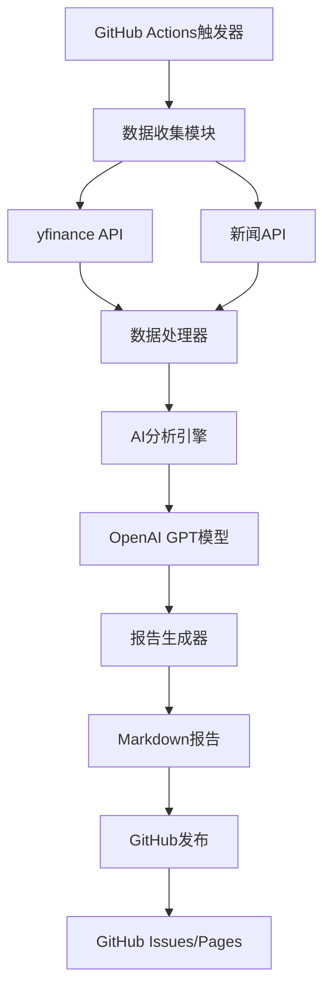

## 1. 产品概述
股票订阅日报生成项目是一个自动化工具，每日定时获取股票市场数据和新闻，通过AI分析生成专业的市场日报，并发布到GitHub平台供用户订阅查看。

该项目解决了投资者需要花费大量时间收集和分析市场信息的问题，为散户投资者、量化交易员和金融分析师提供及时、专业的市场洞察。

## 2. 核心功能

### 2.1 用户角色
本项目为开源工具，主要面向GitHub用户群体：

| 角色 | 获取方式 | 核心权限 |
|------|----------|----------|
| 订阅者 | GitHub Star/Fork项目 | 查看日报、接收更新通知 |
| 贡献者 | 提交PR或Issue | 改进功能、报告问题 |

### 2.2 功能模块
股票日报生成系统包含以下核心功能：

1. **数据采集模块**: 股票价格、交易量、市场指数获取
2. **新闻聚合模块**: 财经新闻和市场动态收集
3. **AI分析模块**: 市场趋势分析和新闻摘要生成
4. **报告生成模块**: Markdown格式日报自动生成
5. **发布模块**: GitHub Issues/Pages自动发布
6. **调度模块**: GitHub Actions定时任务管理

### 2.3 功能详情
| 功能名称 | 子模块 | 功能描述 |
|----------|--------|----------|
| 数据采集 | 股票数据获取 | 使用yfinance API获取美股、A股主要指数和个股数据 |
| 数据采集 | 市场指标计算 | 计算涨跌幅、成交量、技术指标等关键数据 |
| 新闻聚合 | 新闻源获取 | 从主流财经媒体API获取当日重要财经新闻 |
| 新闻聚合 | 内容筛选 | 基于关键词和重要性对新闻进行筛选排序 |
| AI分析 | 趋势分析 | 使用OpenAI GPT模型分析市场走势和热点板块 |
| AI分析 | 新闻摘要 | 自动生成新闻要点摘要和投资提示 |
| 报告生成 | 模板渲染 | 使用Jinja2模板生成结构化Markdown报告 |
| 报告生成 | 图表生成 | 使用matplotlib生成关键数据图表 |
| 发布管理 | GitHub发布 | 自动创建GitHub Issue或更新Pages页面 |
| 调度管理 | 定时任务 | GitHub Actions每日定时执行报告生成 |

## 3. 核心流程

### 3.1 日报生成流程
系统每日自动执行以下流程：

1. **数据收集阶段** (08:00 UTC+8): 获取前一交易日收盘数据
2. **新闻收集阶段** (08:30 UTC+8): 收集隔夜重要财经新闻
3. **AI分析阶段** (09:00 UTC+8): 生成市场分析和投资建议
4. **报告生成阶段** (09:30 UTC+8): 整合数据和生成Markdown报告
5. **发布阶段** (10:00 UTC+8): 发布到GitHub平台

### 3.2 系统架构流程

## 4. 用户界面设计

### 4.1 设计规范
- **报告格式**: 标准Markdown格式，支持GitHub渲染
- **配色方案**: 使用GitHub原生主题，确保最佳可读性
- **图表风格**: 简洁专业的金融图表，使用matplotlib默认样式
- **布局结构**: 清晰的标题层级，便于快速浏览

### 4.2 报告内容结构
| 模块名称 | 内容元素 | 设计说明 |
|----------|----------|----------|
| 标题区域 | 日期、市场概览 | 使用一级标题，包含报告生成时间 |
| 市场概况 | 主要指数表现 | 表格形式展示涨跌数据 |
| 热点分析 | 板块热力图 | 使用颜色编码表示板块强弱 |
| 个股动态 | 重要个股表现 | 列表形式展示关键个股数据 |
| 新闻摘要 | 重要新闻要点 | 使用列表和引用格式 |
| AI分析 | 投资建议 | 使用引用块突出显示 |
| 技术指标 | 图表展示 | 嵌入matplotlib生成的图表 |

### 4.3 响应式设计
- **GitHub兼容性**: 确保在GitHub网页和移动端正常显示
- **邮件适配**: 支持通过GitHub通知邮件查看报告摘要
- **RSS支持**: 提供RSS订阅功能供第三方应用集成